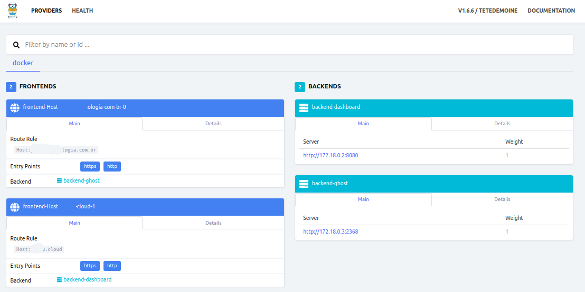

## Ghost Blog with MySQL and Traefik with Docker using Let’s Encrypt certificate authority

Ghost is a powerful open source publishing and blog platform based on nodejs.

Traefik is modern HTTP reverse proxy and load balancer for microservices. Traefik makes all microservices deployment easy, integrated with existing infrastructure components such as Docker, Swarm Mode, Kubernetes, Amazon ECS, Rancher, Etcd, Consul etc.

# What we will do
  - Configure Ghost Stack
  - Create a Custom Network
  - Create a Project Directory
  - Create and Configure MySQL Container
  - Create and Configure Traefik Reverse Proxy
  - Create and Configure Ghost Container
  - Deploy Ghost with MySQL and Traefik
  - Testing

### Configure Ghost Stack

```sh
$ docker network ls
$ docker network create traefiknet
$ docker network ls
```
### Configure MySQL Service

Edit the 'docker-compose.yml' file and change the items that are between << >>
      
    ...
    MYSQL_ROOT_PASSWORD: <<SET-ROOT-PASSWORD>>
    MYSQL_USER: <<SET-USER-MYSQL>>
    MYSQL_PASSWORD: <<SET-PASSWORD>>
    MYSQL_DATABASE: <<SET-DATABASE>>
    ...

### Configure Traefik Reverse Proxy

Still in docker-compose.yml, change the other itens that is between << >>

    ...
    - "traefik.frontend.rule=Host:<<SET-TRAEFIK-HOSTNAME>>"
    ...
    - "traefik.frontend.rule=Host:<<SET-SITE-HOSTNAME>>"
    ...
    database__connection__user: <<SET-USER-MYSQL>>
    database__connection__password: <<SET-PASSWORD>>
    database__connection__database: <<SET-DATABASE>>
    ...
Before editing the 'docker-compose.yml' script, we need edit a traefik configuration named 'traefik.toml'. Change the itens that is between << >>

    ...
    "<<USERNAME:PASSWORD>>", # generate this with htpasswd -nb user password        
    ...
    domain = "<<DOMAIN>>"
    ...
    email = "<<CHANGE-TO-USERNAME-IN-LETSENCRYPT>>"
    ...
Create the blank 'acme.json' file and change the permission to 600.

    touch acme.json
    chmod 600 acme.json 

### Deploy Ghost with MySQL and Traefik

    docker-compose up -d

If you have an error, check the container log using commands below.

    docker-compose logs mysql
    docker-compose logs traefik
    docker-compose logs ghost

### Testing

Open the Traefik dashboard with its URL, mine is http://<<TRAEFIK-HOSTNAME>>/. Log in with the user and password on the 'traefik.toml' file, and following is the Traefik dashboard.
  
  
      
For the Ghost installation, type the ghost URL on the address bar, mine is http://<<SITE-HOSTNAME>>/


